# Pac-Man Arcade Game Logic and Functionality

## Executive summary

The 1980 arcade Pac-Man (originally released by entity["organization","Namco","japan game company"] and later widely distributed by entity["company","Midway Manufacturing","arcade publisher chicago, us"]) is a tightly engineered, deterministic real‑time system built around a 60 Hz update cadence, a tile-grid maze, and a small set of interacting finite-state machines (FSMs): the player avatar, four ghosts, a global “mode” controller, a pellet/bonus controller, and a life/round controller. Its feel is not primarily “pathfinding” in the modern A* sense; it is a rule- and table-driven pursuit system that (a) updates targets on the tile grid, (b) restricts legal turns, reversals, and tunnel speed, and (c) uses deterministic tie-break rules at intersections—yielding repeatable patterns that expert players can learn. citeturn0search5turn0search6turn9search18turn14view1turn15search8

The best-supported technical picture of original behavior comes from ROM-derived analyses and disassemblies (notably the long-running community reverse engineering record), with particularly influential synthesis in entity["people","Jamey Pittman","author pac-man dossier"]’s *The Pac‑Man Dossier*. citeturn9search18turn9search24 The disassembly tradition emphasizes that many “mysteries” (ghost personalities, fruit timing, the level‑256 kill screen) arise from compact integer logic and byte-sized counters, not from complex AI. citeturn9search18turn4search5turn9search6

Key mechanics to reproduce faithfully in modern implementations include (1) pellet and power pellet scoring, ghost-eaten score doubling chains, and two fruit spawns per board; (2) per-level (or per-level‑range) speed and frightened timers; (3) the global scatter/chase schedule that periodically flips ghost objectives (and forces reversals); (4) per-ghost targeting formulas (including the famous “up-direction” bug that shifts two ghosts’ targets); and (5) the level‑256 memory overwrite that corrupts the right side of the maze (“kill screen”). citeturn9search18turn9search6turn4search5turn31view0turn9search21

## Arcade system model and core loop

### Hardware-facing memory map and I/O model

On Pac‑Man hardware, the program ROM occupies 0x0000–0x3FFF, with video RAM at 0x4000–0x43FF and color RAM at 0x4400–0x47FF; general RAM sits around 0x4C00–0x4FFF. Inputs (joysticks, coins, start buttons, DIP switches) are memory-mapped at addresses like 0x5000/0x5040/0x5080/0x50C0, and a watchdog reset is performed by writing to 0x50C0. citeturn14view1turn15search8

This “everything is a memory address” model strongly shapes the code structure: the main loop sets up interrupts, then repeatedly (a) reads inputs, (b) advances state machines, (c) updates VRAM/sprite registers, and (d) “kicks” the watchdog to prevent hardware reset. citeturn14view1turn15search8

### High-level state machine

A practical abstraction (consistent with disassembly-based descriptions of Pac‑Man-family codebases) is:

- **Attract/Demo state**: runs scripted movement and title screens, polls coin/start. citeturn15search8turn31view0  
- **Round init state**: resets pellet grid, positions sprites, resets mode timers, resets per-round counters. citeturn9search18turn14view1  
- **Playing state**: the real-time loop (movement, collisions, scoring, spawns). citeturn9search18turn31view0  
- **Death/respawn state**: plays death animation, decrements life count, resets actors, resumes the round. citeturn1search0turn9search18  
- **Intermission/cutscene state**: between specific rounds, runs a scripted animation sequence. citeturn9search18  
- **Game over state**: commits high score tables, returns to attract. citeturn1search0turn31view0  

Because original code uses compact tables and byte counters, modern “faithful” reimplementations often keep a 1:1 memory model (the same addresses/variables) to match behavior. citeturn31view0turn14view1turn15search8

### Pseudocode: main loop skeleton

```pseudo
const TICK_HZ = 60

loop forever:
  wait_for_vblank_or_tick()

  read_inputs()
  if state == ATTRACT:
      run_attract_step()
  else if state == ROUND_INIT:
      init_round()
  else if state == PLAYING:
      update_global_mode_timer()          // scatter/chase + forced reversals
      update_pacman_movement()
      update_ghosts()                     // per-ghost FSM + targeting + turning
      handle_pellet_consumption()
      handle_fruit_spawn_and_despawn()
      resolve_collisions()                // pacman vs ghosts; ghosts vs house door rules
      check_round_complete()
  else if state == PACMAN_DYING:
      run_death_animation_and_respawn()
  else if state == INTERMISSION:
      run_cutscene_step()
  else if state == GAME_OVER:
      show_game_over_and_return_to_attract()

  render_tile_and_sprite_updates()
  reset_watchdog()
```

The above is conceptual; original implementations distribute work across interrupt-driven timing and compact task lists (a common pattern documented for Pac‑Man-family hardware programming). citeturn15search8turn14view1turn31view0

## Maze layout, level progression, pellets, and scoring

### Maze grid and traversability

The maze is fundamentally a **tile grid** with walls encoded as blocked tiles and open corridors as passable tiles; movement is continuous in pixel space, but legal turns and decisions are evaluated relative to tile centers and tile adjacency. citeturn9search18turn15search8 This “grid with continuous positions” hybrid is central to Pac‑Man’s characteristic cornering, where turns can occur with small alignment windows rather than requiring perfect center alignment. citeturn9search18turn30search13

### Round completion and level progression

A round ends when all pellets (regular pellets plus power pellets) are consumed; the next round restarts the same maze with updated speed/timer parameters and the next fruit symbol in the bonus sequence. citeturn9search18turn4search5 At specific rounds, an intermission cutscene plays instead of immediately starting the next round. citeturn9search18

### Pellet and power pellet rules

The canonical scoring rules in the original arcade release are:

| Event | Score effect |
|---|---:|
| Eat a pellet | 10 |
| Eat a power pellet (energizer) | 50 |
| Eat ghosts during frightened (“blue”) mode | 200, 400, 800, 1600 (doubles per ghost in the chain, resets after frightened ends) |

These values and the ghost-score doubling ladder are standard in original arcade documentation and are reiterated in authoritative technical summaries. citeturn1search0turn9search18

### Fruit/bonus items: spawn, position, scoring

A bonus fruit (or item symbol) spawns **twice per round** at a fixed location near the ghost house region, controlled by a dot-eaten counter and per-spawn flags (commonly documented as “first fruit appeared” / “second fruit appeared” style state). citeturn9search18turn26view2turn19view1 The bonus is available for a limited time and disappears if not collected. citeturn9search18

A widely documented arcade sequence of bonus items (with their point values) is:

| Round range | Bonus symbol | Points |
|---|---|---:|
| 1–2 | Cherry | 100 |
| 3–4 | Strawberry | 300 |
| 5–6 | Orange | 500 |
| 7–8 | Apple | 700 |
| 9–10 | Melon | 1000 |
| 11–12 | Galaxian flagship | 2000 |
| 13–14 | Bell | 3000 |
| 15+ | Key | 5000 |

This table is consistently reported in technical references (and corresponds to standard arcade scoring tables). citeturn1search0turn9search18

image_group{"layout":"carousel","aspect_ratio":"16:9","query":["Pac-Man 1980 maze layout screenshot","Pac-Man bonus fruit cherry strawberry orange apple melon bell key","Pac-Man fruit spawn position under ghost house"],"num_per_query":1}

## Collision detection, life cycle, and respawn semantics

### Collision model: walls, pellets, and ghosts

Pac‑Man collision handling is best understood as **two separate collision systems**:

1. **Grid collision** (Pac‑Man vs. walls and pellet tiles): movement is allowed only into passable tiles; pellet consumption is triggered when Pac‑Man’s position crosses the pellet-bearing tile region (implementation-dependent thresholds produce the original “cornering” feel). citeturn9search18turn30search13turn15search8  
2. **Sprite/entity collision** (Pac‑Man vs. ghosts and fruit): typically evaluated via proximity thresholds in position space (often approximated as overlap of bounding regions around sprite centers). citeturn15search8turn30search13  

### Life and respawn rules

A collision between Pac‑Man and any ghost has two possible outcomes depending on ghost state:

- If the ghost is in normal (non-frightened) state, Pac‑Man loses a life, a death animation plays, and the round restarts from a respawn configuration (pellets remain cleared; counters may be partially reset depending on the original logic). citeturn1search0turn9search18turn4search5  
- If the ghost is frightened (blue), the ghost is “eaten,” awarding the next value in the doubling chain and transitioning that ghost into a “returning eyes” state heading back to the house to regenerate. citeturn9search18turn1search0  

Extra lives are configured via DIP switches in the arcade cabinet (commonly a single bonus life at a chosen score threshold, depending on operator settings). citeturn1search0turn15search8

### Pseudocode: collision resolution and pellet consumption

```pseudo
function handle_pellet_consumption():
  tile = tile_at(pacman.position)
  if tile.has_pellet:
      score += 10
      tile.clear_pellet()
      dot_counter += 1
      apply_pacman_eat_delay()     // classic slowdown while eating
  if tile.has_power_pellet:
      score += 50
      tile.clear_power_pellet()
      dot_counter += 1
      start_frightened_mode()      // sets frightened timer, reverses ghosts
      reset_ghost_eat_chain()

function resolve_collisions():
  if fruit_active and overlap(pacman, fruit):
      score += fruit_value_for_round(round_index)
      fruit_active = false

  for ghost in ghosts:
      if overlap(pacman, ghost):
          if ghost.is_frightened:
              score += ghost_chain_value()   // 200,400,800,1600
              ghost.enter_eyes_return_state()
              increment_ghost_chain()
          else if ghost.is_vulnerable_to_kill:  // normal chase/scatter
              start_pacman_death_sequence()
              return
```

The “eat delay” and “frightened mode” interactions are essential to original difficulty: eating pellets slightly slows Pac‑Man, and frightened mode both changes ghost behavior and creates a risk/reward window for maximizing score. citeturn9search18turn1search0

## Ghost AI: global modes, per-ghost targeting, and movement constraints

### Global ghost modes: scatter, chase, frightened

Ghost behavior is governed by a global mode controller:

- **Scatter**: each ghost targets its own corner (or corner region), producing the classic “retreat” waves. citeturn9search18  
- **Chase**: each ghost computes a target tile using its individual targeting algorithm. citeturn9search18turn9search6  
- **Frightened** (triggered by power pellet): ghosts move with reduced speed and a different decision policy (often randomized at intersections), and can be eaten. citeturn9search18turn1search0  

A crucial mechanical detail is that **mode changes force ghost reversals** (ghosts immediately reverse direction when switching between chase and scatter, and typically also when entering frightened mode), which is highly exploitable by expert pathing. citeturn9search18

### Individual targeting algorithms with formulas

Pac‑Man’s “ghost personalities” are expressed as deterministic target-tile computation. Define:

- Pac‑Man tile: \(P=(P_x,P_y)\)  
- Pac‑Man direction unit vector: \(d\in\{(1,0),(-1,0),(0,1),(0,-1)\}\)  
- Blinky tile: \(B=(B_x,B_y)\)  
- Ghost tile: \(G=(G_x,G_y)\)  
- Squared distance: \(\|u\|^2 = u_x^2 + u_y^2\)

A well-documented implementation quirk: when Pac‑Man faces “up,” some target-offset code effectively applies an extra left shift (“up-direction bug”), which changes Pinky’s and Inky’s effective aiming. citeturn9search18turn9search6turn9search21

#### Targeting table

| Ghost | Chase target formula | Notes |
|---|---|---|
| **entity["fictional_character","Blinky","pac-man red ghost"]** | \(T = P\) | Direct pursuit; later gains a speed/behavior boost as pellets run low (“Cruise Elroy” in common technical terminology). citeturn9search18 |
| **entity["fictional_character","Pinky","pac-man pink ghost"]** | \(T = P + 4d\) | With the up-direction bug, “up” behaves like \(T=(P_x-4, P_y-4)\) in many descriptions. citeturn9search18turn9search6turn9search21 |
| **entity["fictional_character","Inky","pac-man cyan ghost"]** | Let \(A = P + 2d\). Then \(T = B + 2(A - B)=2A - B\). | This “vector from Blinky through a point ahead of Pac‑Man” makes Inky’s net behavior highly context-dependent; also inherits the up-direction offset quirk in common analyses. citeturn9search18turn9search6 |
| **entity["fictional_character","Clyde","pac-man orange ghost"]** | If \(\|P-G\| \ge 8\) tiles, \(T=P\); else \(T=\) Clyde’s scatter corner. | Produces “approach then flee” behavior. citeturn9search18 |

Because targets are on the tile grid and updated frequently, the ghosts’ pursuit looks “smart” despite being built from small integer operations and tile-distance comparisons. citeturn9search18turn9search24

### Worked examples of targeting

Assume Pac‑Man is at \(P=(14,23)\) moving right so \(d=(1,0)\), and Blinky is at \(B=(10,20)\):

- Blinky: \(T=(14,23)\). citeturn9search18  
- Pinky: \(T=(14,23)+4(1,0)=(18,23)\). citeturn9search18  
- Inky: \(A=(14,23)+2(1,0)=(16,23)\), so \(T=2A-B=(32,46)-(10,20)=(22,26)\). citeturn9search18  
- Clyde: if Clyde is within 8 tiles of Pac‑Man, it targets its corner instead of \(P\). citeturn9search18  

In the special “Pac‑Man facing up” case, Pinky’s (and thus Inky’s) computed offsets shift left as well, creating the famous “ambush from above-left” quirk. citeturn9search18turn9search6turn9search21

### Movement rules at intersections: legal directions, tie-break order

At a decision tile (an intersection), a ghost evaluates candidate directions with constraints:

1. **Cannot reverse direction** in chase/scatter except when a mode change forces reversal (and some house-related exceptions). citeturn9search18  
2. **Cannot turn into walls**. citeturn9search18turn15search8  
3. **Restricted tiles**: certain upward turns near/around the ghost house are disallowed (a detail that changes path geometry and is a common source of inaccurate clones). citeturn9search18  
4. **Distance minimizing choice**: choose the direction whose next-tile position minimizes squared distance to the target tile. citeturn9search18  
5. **Deterministic tie-break**: when distances tie, a fixed priority ordering is applied (commonly reported as Up > Left > Down > Right). citeturn9search18  

In frightened mode, many implementations treat the decision as random among legal non-reverse directions, which matches the canonical “jittery escape” behavior described in technical analyses. citeturn9search18turn31view0

### Mode timing and speed by level: what is known vs unspecified here

Original Pac‑Man uses **table-driven per-level (or per-level-range) parameters** controlling:

- Pac‑Man base speed (and a distinct speed while eating dots),  
- ghost base speed, frightened speed, and tunnel speed,  
- frightened duration (eventually reaching zero at high rounds), and  
- the scatter/chase schedule. citeturn9search18turn9search24  

A complete numeric table is documented in *The Pac‑Man Dossier* and in ROM-derived codebases that preserve the original tables. citeturn9search18turn31view0turn30search0

Because this run could not extract all line-level table constants from the largest code listings, the report provides the **canonical structure** (and a fully specified Level‑1 schedule below), while marking the full per-level numeric matrix as “see primary tables.” citeturn9search18turn31view0turn30search0

#### Mermaid mode schedule timeline

Level 1 is widely documented as alternating scatter and chase in a fixed sequence, then staying in chase for the remainder of the round. citeturn9search18turn9search24

```mermaid
gantt
  title Pac-Man (Arcade) Global Ghost Mode Schedule (Level 1)
  dateFormat  s
  axisFormat  %Ss

  section Scatter/Chase
  Scatter 1   :active, s1, 0, 7
  Chase 1     :c1, 7, 20
  Scatter 2   :s2, 27, 7
  Chase 2     :c2, 34, 20
  Scatter 3   :s3, 54, 5
  Chase 3     :c3, 59, 20
  Scatter 4   :s4, 79, 5
  Chase 4*    :c4, 84, 999
```



\*Chase 4 continues “until round completion” (effectively unbounded in the original schedule). citeturn9search18turn9search24

### Pseudocode: ghost AI state machine

```pseudo
enum GhostMode { SCATTER, CHASE, FRIGHTENED, EYES_RETURNING, IN_HOUSE, LEAVING_HOUSE }

function update_ghost(ghost):
  if ghost.mode == EYES_RETURNING:
      target = house_entry_tile
      ghost.direction = choose_direction_toward(target, allow_reverse=true)
      if ghost.at_house_entry():
          ghost.mode = IN_HOUSE
      return

  if ghost.mode == IN_HOUSE:
      run_house_bounce_and_release_logic(ghost)  // dot counters + timers
      return

  // SCATTER, CHASE, FRIGHTENED
  if global_mode_changed_this_tick:
      ghost.direction = reverse(ghost.direction)

  if ghost.at_intersection():
      if ghost.mode == FRIGHTENED:
          ghost.direction = choose_random_legal_direction(exclude_reverse=true)
      else:
          target = compute_target_tile(ghost, global_mode)
          ghost.direction = choose_direction_minimizing_distance(target, exclude_reverse=true)

  ghost.speed = lookup_speed(ghost, context=tunnel/frightened/elroy/normal)
  ghost.position += ghost.direction * ghost.speed
```

The “house release logic” (dot counters and inactivity timers) is a major contributor to early-level behavior and is heavily studied in ROM analyses. citeturn9search18turn26view2turn19view1

## Tunnels, wraparound, fruit timing signals, and the level-256 kill screen

### Tunnel behavior and wraparound

The side tunnels implement horizontal wraparound: crossing beyond one boundary teleports the actor to the opposite side corridor, with speed typically reduced in the tunnel region (separate “tunnel speed” tables exist for ghosts and, in many analyses, for Pac‑Man). citeturn9search18turn19view1turn15search8

A key implementation detail is that tunnel movement often uses **distinct movement patterns/tables** (e.g., separate “tunnel areas” movement bit patterns are documented in disassembly-derived variable maps for each ghost). citeturn19view1turn26view2

### Fruit appearance timing and position signals in code-derived documentation

Disassembly-derived documentation for Pac‑Man-family codebases commonly identifies:

- a **dot counter** tracking how many pellets have been eaten this round,  
- flags for whether the **first** and **second** fruit have been released, and  
- a memory location for **fruit position** and **fruit value** (0 if absent). citeturn26view2turn19view1  

These variables support the two-spawn-per-round behavior described in authoritative analyses. citeturn9search18turn26view2

### Level 256 kill screen: cause and observable behavior

The “kill screen” at level 256 (sometimes described as a “split-screen” or corrupted right-half maze) is widely attributed to an **8-bit overflow**: the level counter (or a derived value used by UI/bonus drawing logic) wraps at 256, and a drawing routine writes past its intended bounds, corrupting video/maze data. citeturn4search5turn9search6

Observable outcomes described in technical glitch documentation include:

- the right half of the maze becomes corrupted by garbled tiles/symbols; citeturn4search5turn9search6  
- the round is effectively unfinishable under normal play because the level-completion dot count cannot be satisfied with the corrupted pellet layout (or pellets are not all accessible/visible depending on corruption); citeturn4search5turn9search6  
- unusual warp/collision artifacts can occur because the tile collision map is partially overwritten. citeturn4search5turn9search6  

This behavior is sufficiently stable across original hardware reports and emulation to be treated as a defining property of the original game. citeturn4search5turn9search6turn9search18

image_group{"layout":"carousel","aspect_ratio":"16:9","query":["Pac-Man level 256 kill screen split screen","Pac-Man arcade kill screen corrupted right side maze","Pac-Man map 256 glitch screenshot"],"num_per_query":1}

## ROM and disassembly references, plus ports and modern implementations

### ROM/disassembly anchors and what they provide

While official original source code is not publicly released, several ROM-derived resources provide stable anchors for rigorous analysis:

- **Hardware memory map and ports**: the Pac‑Man memory layout (ROM/RAM/VRAM/input addresses) is documented in classic hardware notes and mirrors. citeturn14view1turn15search8  
- **Ms. Pac‑Man documented disassembly** (a Pac‑Man-derived codebase with extensive annotation): provides concrete addresses/labels for ghost positions, orientations, dot counters, fruit flags, task scheduling structures, and more. citeturn14view2turn26view2turn23view1  
- **ROM-to-C translation projects**: entity["people","Mark Burkley","author pacman-c"]’s “pacman‑c” states its explicit goal of identically matching original behavior and preserving original ROM logic as comments/structure, enabling debugger-level scrutiny of tables and routines. citeturn31view0turn30search0  

A representative Z80 disassembly excerpt illustrating the interrupt-driven architecture can be seen in Pac‑Man-family sound/VBLANK listings where the vblank routine copies computed parameters to hardware registers and then processes effect logic. citeturn7view0turn15search8

### Annotated excerpt: memory map essentials

From the Pac‑Man memory layout reference:

- Program ROM: 0x0000–0x3FFF  
- Video RAM: 0x4000–0x43FF; Color RAM: 0x4400–0x47FF  
- Input ports: 0x5000 (IN0), 0x5040 (IN1), 0x5080 (DSW1), 0x50C0 (watchdog reset) citeturn14view1turn15search8  

These addresses are more than trivia: accurate clones frequently fail by not reproducing the exact update rhythm and memory-mapped I/O semantics that the original program assumes. citeturn15search8turn31view0

### Differences in major ports/remakes and common modern implementations

Because “Pac‑Man” has been ported and remade countless times, differences cluster into a few recurring categories:

1. **Ghost aiming bug compatibility**: some modern recreations intentionally omit (or optionally disable) the up-direction targeting bug that affects Pinky/Inky aiming, even when otherwise implementing the classic target-tile system. citeturn9search21turn9search6  
2. **Timing and speed fidelity**: accurate implementations must reproduce (a) speed differences while eating dots, (b) tunnel slowdowns, and (c) frightened timers diminishing with level; implementations that use constant speeds materially change difficulty and break “patternable” play. citeturn9search18turn31view0turn30search13  
3. **Derivative arcade variants**: entity["video_game","Ms. Pac-Man","arcade 1981"] is not just “Pac‑Man with a bow”—it uses additional code space and introduces different maze sets and fruit movement logic, motivating separate disassembly-level documentation. citeturn14view1turn14view2turn23view0  
4. **Hack/upgrade boards and variants**: annotated disassembly projects catalog numerous variants and patches (speed hacks, bug fixes, alternate maps), illustrating how compact changes can materially alter play. citeturn23view0turn23view1turn11search2  
5. **Emulation vs reimplementation**: emulator-centric projects (e.g., machine emulators that support multiple ROM sets) emphasize precise hardware behavior, while reimplementations may choose “gameplay equivalence” and still diverge subtly in cornering and collision thresholds unless the original tables are preserved. citeturn30search1turn31view0turn15search8  

### What remains unspecified here

The original ROM contains detailed per-level tables (speeds, frightened durations/flash counts, scatter/chase schedules by level band, dot-counter release thresholds, and Blinky “pellet-left” thresholds). These are documented in authoritative technical sources, but this run could not extract and reproduce the full numeric matrix directly from the largest code listings within the available tool budget. For complete numeric tables, consult *The Pac‑Man Dossier* and ROM-derived translation/disassembly projects. citeturn9search18turn9search24turn31view0turn30search0